# Building My First MCP Tool: Real-Time DateTime for AI Assistants

*How I solved a common developer pain point and discovered the power of Model Context Protocol*

---

Picture this: you're deep in a coding session with Claude or Cursor, asking it to generate a SQL migration file. Everything's going perfectly until it names the file `2024-01-01-create_users_table.sql` — except it's August 2025. Now you're manually updating timestamps, breaking your flow, and wondering if there's a better way.

This exact frustration led me to build **@strix-ai/currentdt-mcp** — **my very first Model Context Protocol (MCP) tool**. I created this to solve my own daily workflow interruption, and what started as a simple personal solution became a journey into the fascinating world of extending AI capabilities.

> **Built for AI, Built with AI** — This entire project was conceived, planned, and largely implemented through AI-assisted development, showcasing how AI can help create better AI tools.


## The Problem: When AI Needs to Know "When"

Modern AI assistants are incredibly powerful, but they have one significant blind spot: they don't know what time it is right now. When you ask Claude to:

- Generate timestamped migration files
- Create log entries with current dates
- Update documentation with today's date
- Name files with current timestamps

...you're forced to either accept outdated information or manually provide the current date/time, breaking your development flow.

For developers using AI-powered IDEs like Cursor, Claude Desktop, or VS Code with AI extensions, this becomes a daily friction point. I found myself constantly typing "the current date is..." or manually fixing timestamps in AI-generated code.

## Discovering Model Context Protocol (MCP)

The solution came when I discovered MCP — Anthropic's open standard for connecting AI assistants to external data and tools. Think of it as a universal API that lets AI assistants securely access real-world information and capabilities.

MCP works by running "servers" that expose specific tools to AI clients. When an AI assistant needs current datetime information, it can call your MCP tool just like it would use any built-in capability.

The beautiful part? Once configured, it's completely invisible to the user. You just ask for timestamped code, and the AI assistant automatically fetches the current time and generates perfectly dated content.

## Building the Solution

### Technical Architecture

I designed `@strix-ai/currentdt-mcp` with clean architecture principles:

```
AI Client (Cursor/Claude) → MCP Protocol → DateTime Server → Time Providers → System Clock/Remote APIs
```

The core components:

- **MCP Server**: Handles protocol communication and tool registration
- **DateTime Service**: Core business logic for formatting and validation
- **Provider System**: Pluggable time sources (local system clock, remote APIs)
- **Configuration Manager**: JSON config files and environment variables

### Key Design Decisions

**1. Zero Configuration Default**
The tool works immediately after `npm install -g @strix-ai/currentdt-mcp` — no setup required. But it's fully configurable for power users.

**2. Multiple Format Support**
Beyond ISO 8601, it supports custom formats using familiar tokens:
- `YYYY-MM-DD HH:mm:ss` → `2025-08-26 14:30:00`
- `YYYY-MM-DD-HHmmss` → `2025-08-26-143000` (perfect for migration files)
- `MM/DD/YYYY` → `08/23/2025`

**3. Provider Architecture**
Local system clock for speed and reliability, with optional remote time services for distributed systems requiring precise synchronization.

**4. Error Handling & Fallbacks**
If the primary provider fails, it gracefully falls back to alternatives, ensuring your workflow never breaks.

## Real-World Impact

The difference is immediately noticeable. Before:

```
You: "Create a migration to add user preferences"
Claude: "I'll create a migration file..."
[Generates: 2024-01-01-123456_add_user_preferences.sql]
You: [Manually fixes timestamp to current date]
```

After:

```
You: "Create a migration to add user preferences"  
Claude: "I'll create a migration file with the current timestamp..."
[Generates: 2025-08-26-143022_add_user_preferences.sql]
You: [Perfect! Continues coding]
```

## Technical Challenges & Solutions

### MCP Protocol Compliance
The biggest challenge was understanding MCP's strict requirements. MCP servers must output only JSON-RPC messages to stdout — any logging or debugging must go to stderr. This took several iterations to get right.

### Cross-Platform Compatibility  
Supporting Windows, macOS, and Linux required careful handling of process spawning and path resolution. TypeScript's type system was invaluable here.

### Performance Optimization
For a tool that gets called frequently, performance matters. I implemented:
- Lazy provider initialization
- Response caching for remote providers
- Minimal object allocation in hot paths

### The Development Flow

```mermaid
flowchart LR
    A["😤 Personal<br/>Problem"] --> B["🔍 Research<br/>MCP"]
    B --> C["🏗️ Design<br/>Architecture"]
    C --> D["💻 Implement<br/>Solution"]
    D --> E["🧪 Test<br/>& Debug"]
    E --> F["📚 Document<br/>& Polish"]
    F --> G["🚀 Share with<br/>Community"]
    G --> H["💬 Community<br/>Feedback"]
    H --> A
    
    style A fill:#ffebee,stroke:#d32f2f,stroke-width:2px
    style G fill:#e8f5e8,stroke:#388e3c,stroke-width:2px
    style H fill:#e3f2fd,stroke:#1976d2,stroke-width:2px
```



**Key Insight:** Building your first tool is intimidating, but starting with your own daily frustration provides immediate validation and motivation.

## The MCP Ecosystem Opportunity

Building this tool opened my eyes to MCP's potential. We're at the beginning of a new ecosystem where developers can extend AI assistants with domain-specific capabilities:

- **File System Tools**: Let AI assistants read/write files securely
- **Database Connectors**: Query databases directly from AI conversations  
- **API Integrations**: Connect to your company's internal services
- **Development Tools**: Git operations, Docker management, CI/CD triggers

Each tool makes AI assistants more powerful and contextual for specific workflows.

## Lessons Learned

### 1. Start with Your Own Pain Point
The best tools solve problems you personally experience. As my first MCP tool, using `@strix-ai/currentdt-mcp` in my daily workflow provided immediate feedback and guided development priorities. There's no better product validation than solving your own daily annoyance.

### 2. Design for Extensibility
The provider architecture allows for custom time sources without core changes. This pattern works well for MCP tools — design for the 80% case but enable the 20% extensions.

### 3. Documentation is Critical
MCP is still emerging, so clear installation and configuration instructions are essential. I spent significant time on examples for each major MCP client.

### 4. Community Matters
The MCP community is incredibly helpful. Sharing early versions and getting feedback accelerated development significantly.

## Looking Forward

Version 1.1.1 represents a stable foundation, but the roadmap is exciting:

- **Enhanced Provider System**: Plugin architecture for loading custom providers from npm packages
- **Timezone Management**: Comprehensive timezone support for global teams
- **Performance Optimizations**: Caching strategies and connection pooling
- **Enterprise Features**: Team configurations and audit logging

## Getting Started

If you're curious about MCP development or just want to eliminate datetime friction in your AI workflow:

```bash
npm install -g @strix-ai/currentdt-mcp
```

Then configure your MCP client (Cursor, Claude Desktop, VS Code, or Windsurf) following the [integration guides](https://github.com/biswajitpanday/CurrentDT-mcp#mcp-client-integration).

The next time you ask your AI assistant to generate timestamped code, it'll just work — and you'll understand why extending AI capabilities through MCP is such a powerful pattern.

## User Flow: From Problem to Solution

```mermaid
graph TD
    A["👨‍💻 Developer asks AI:<br/>'Create migration file'"] --> B["🤖 AI Assistant<br/>receives request"]
    B --> C["🔧 AI calls<br/>get_current_datetime tool"]
    C --> D["⚡ CurrentDT MCP Server<br/>processes request"]
    D --> E["⏰ Time Provider<br/>fetches current time"]
    E --> F["📝 Formatted DateTime<br/>returned to AI"]
    F --> G["✅ AI generates<br/>timestamped migration:<br/>2025-08-26-143000_add_users.sql"]
    G --> H["🎉 Developer continues<br/>coding without interruption"]
    
    style A fill:#e3f2fd,stroke:#1976d2,stroke-width:2px
    style G fill:#e8f5e8,stroke:#4caf50,stroke-width:2px
    style H fill:#fff3e0,stroke:#ff9800,stroke-width:2px
    style D fill:#f3e5f5,stroke:#9c27b0,stroke-width:2px
```



## Architecture at a Glance


## Closing Thoughts

Building my first MCP tool taught me that the most impactful developer tools often solve simple, universal problems elegantly. Every developer has experienced datetime friction with AI assistants, but few knew there was a systematic solution.

**The Personal Journey:** What started as a weekend project to solve my own annoying workflow interruption turned into something much bigger. This was my first foray into the MCP ecosystem, and the experience of building something that directly addressed my daily pain point made every coding session feel purposeful.

As someone passionate about AI-assisted development (you can see more of my work at [biswajitpanday.github.io](https://biswajitpanday.github.io)), I've always believed that the best tools emerge from personal pain points.

MCP represents a fundamental shift in how we think about AI capabilities. Instead of waiting for AI providers to build every conceivable feature, we can extend AI assistants ourselves, creating personalized, powerful development environments.

The future of AI-assisted development isn't just smarter AI — it's AI that knows your world, your data, and your specific needs. MCP makes that future accessible today.

---

**Ready to build your own MCP tool?** Start with a problem you face daily, check out the [MCP specification](https://github.com/modelcontextprotocol/specification), and join the growing community of developers extending AI capabilities.

**@strix-ai/currentdt-mcp** is open source and available on [GitHub](https://github.com/biswajitpanday/CurrentDT-mcp) and [npm](https://www.npmjs.com/package/@strix-ai/currentdt-mcp). Contributions, feedback, and use cases are always welcome.

*Follow me at [biswajitpanday.github.io](https://biswajitpanday.github.io) for more insights on AI-assisted development and developer tooling.*