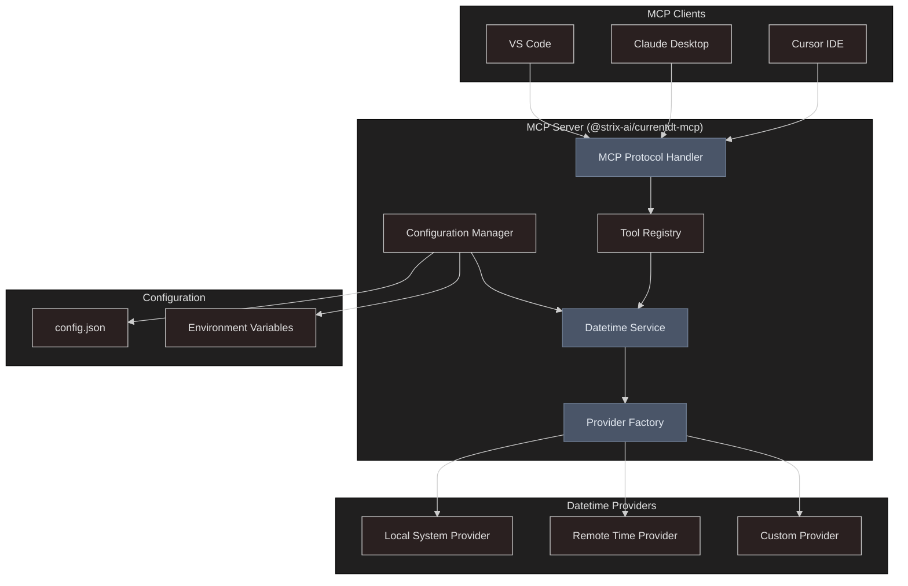
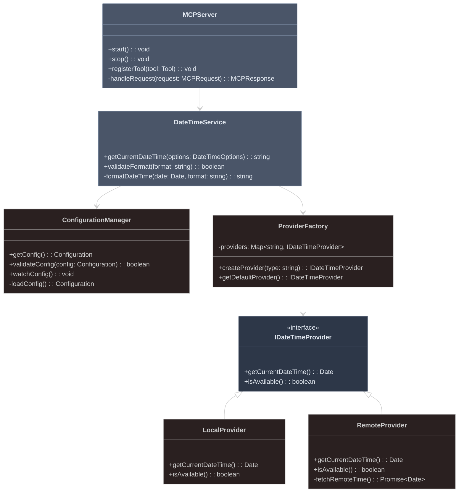
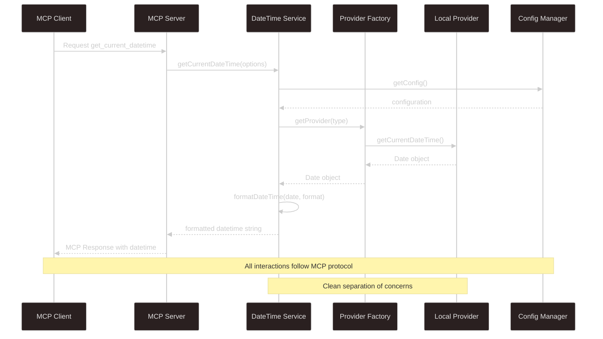
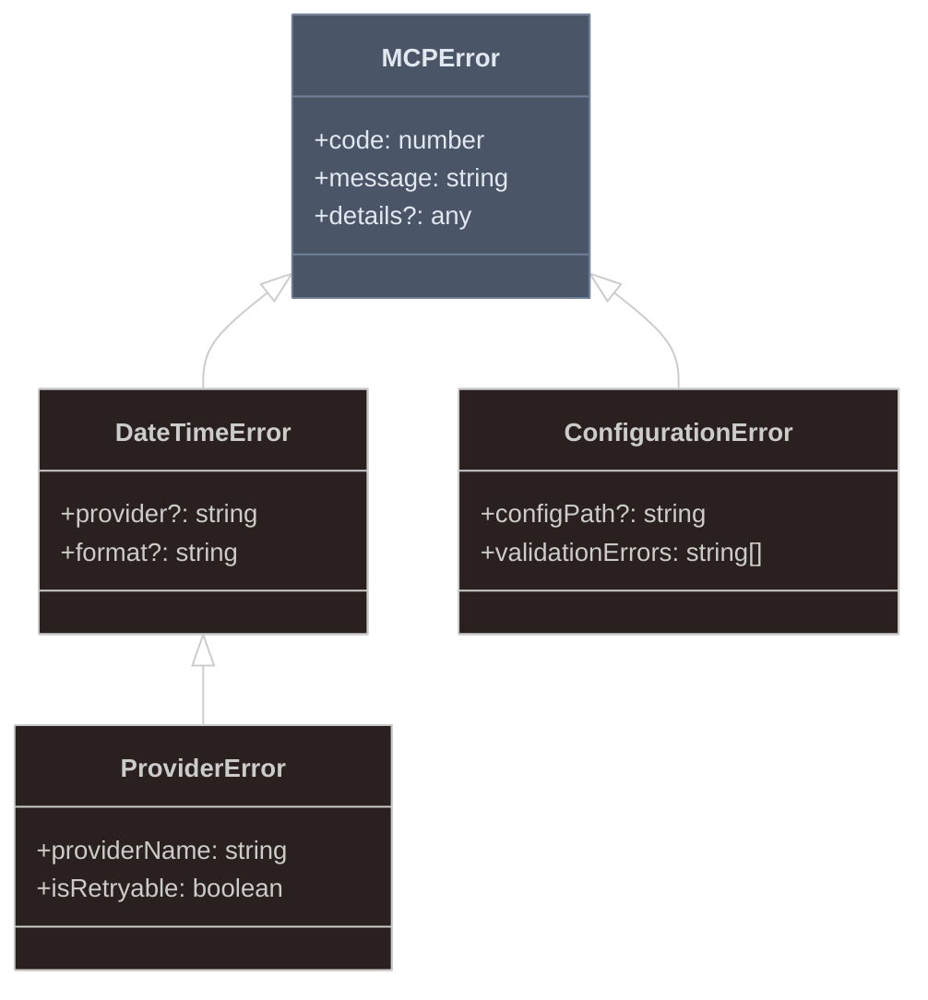
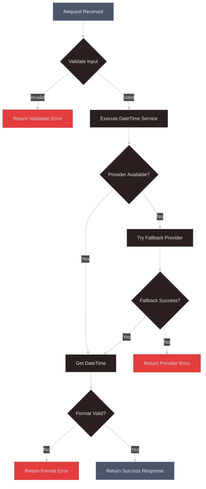

---
config:
  theme: neo-dark
---

# Architecture Document - @strix-ai/currentdt-mcp

> **Built for AI, Built with AI** - This project demonstrates AI-assisted development creating enhanced AI capabilities

**Author:** Biswajit Panday  
**Email:** biswajitmailid@gmail.com  
**Website:** [biswajitpanday.github.io](https://biswajitpanday.github.io)  
**Contributor:** Abdullah Saleh Robin <robinabdullah@yahoo.com>  
**Version:** 1.1.7  
**Date:** August 26, 2025

## 1. Architecture Overview

### 1.1 System Purpose
@strix-ai/currentdt-mcp is designed as a lightweight, extensible MCP server that provides current datetime functionality to AI assistants while maintaining clean architecture principles and supporting multiple configuration options.

### 1.2 Design Principles

#### SOLID Principles
- **Single Responsibility:** Each class has one reason to change
- **Open/Closed:** Open for extension, closed for modification
- **Liskov Substitution:** Implementations are substitutable for interfaces
- **Interface Segregation:** Clients depend only on methods they use
- **Dependency Inversion:** Depend on abstractions, not concretions

#### Additional Principles
- **DRY (Don't Repeat Yourself):** Eliminate code duplication through abstraction
- **YAGNI (You Aren't Gonna Need It):** Implement only required features initially
- **Clean Code:** Self-documenting, readable, and maintainable code
- **Separation of Concerns:** Distinct system aspects handled separately

## 2. High-Level Architecture



## 3. Component Architecture

### 3.1 Core Components



### 3.2 Data Flow Architecture



## 4. Module Structure

### 4.1 Project Structure
```
src/
├── server/
│   ├── MCPServer.ts              # Main MCP server implementation
│   ├── ToolRegistry.ts           # Tool registration and management
│   └── RequestHandler.ts         # MCP request/response handling
├── services/
│   ├── DateTimeService.ts        # Core datetime business logic
│   └── ConfigurationManager.ts   # Configuration handling
├── providers/
│   ├── IDateTimeProvider.ts      # Provider interface
│   ├── LocalProvider.ts          # Local system time provider
│   ├── RemoteProvider.ts         # Remote time service provider
│   └── ProviderFactory.ts        # Provider creation and management
├── types/
│   ├── MCPTypes.ts              # MCP protocol types
│   ├── DateTimeTypes.ts         # Datetime-specific types
│   └── ConfigTypes.ts           # Configuration types
├── utils/
│   ├── DateFormatter.ts         # Date formatting utilities
│   ├── Validator.ts             # Input validation utilities
│   └── Logger.ts                # Logging utilities
└── index.ts                     # Entry point
```

### 4.2 Key Interfaces

```typescript
// Core Service Interface
interface IDateTimeService {
  getCurrentDateTime(options?: DateTimeOptions): Promise<string>;
  validateFormat(format: string): boolean;
  getSupportedProviders(): string[];
}

// Provider Interface
interface IDateTimeProvider {
  getCurrentDateTime(): Promise<Date>;
  isAvailable(): Promise<boolean>;
  getName(): string;
  getPriority(): number;
}

// Configuration Interface
interface Configuration {
  defaultFormat: string;
  defaultProvider: string;
  providers: ProviderConfig[];
  fallbackEnabled: boolean;
  cache?: CacheConfig;
}

// MCP Tool Definition
interface DateTimeTool {
  name: 'get_current_datetime';
  description: string;
  inputSchema: JSONSchema;
}
```

## 5. Design Patterns

### 5.1 Factory Pattern
**Usage:** Provider creation and management
**Benefits:** 
- Decouples provider instantiation from usage
- Enables runtime provider selection
- Simplifies provider registration

```typescript
class ProviderFactory {
  private providers = new Map<string, () => IDateTimeProvider>();
  
  register(name: string, factory: () => IDateTimeProvider): void {
    this.providers.set(name, factory);
  }
  
  create(name: string): IDateTimeProvider {
    const factory = this.providers.get(name);
    if (!factory) throw new Error(`Provider ${name} not found`);
    return factory();
  }
}
```

### 5.2 Strategy Pattern
**Usage:** Multiple datetime providers
**Benefits:**
- Runtime algorithm/provider switching
- Clean separation of provider implementations
- Easy addition of new providers

### 5.3 Singleton Pattern
**Usage:** Configuration manager and server instance
**Benefits:**
- Single source of truth for configuration
- Consistent server state management
- Resource efficiency

### 5.4 Observer Pattern
**Usage:** Configuration change notifications
**Benefits:**
- Reactive configuration updates
- Loose coupling between components
- Event-driven architecture

## 6. Error Handling Strategy

### 6.1 Error Hierarchy


### 6.2 Error Handling Flow


## 7. Performance Considerations

### 7.1 Caching Strategy
- **Provider Results:** Cache datetime for short intervals to reduce system calls
- **Configuration:** Cache validated configuration to avoid repeated parsing
- **Format Validation:** Cache format validation results

### 7.2 Resource Management
- **Memory:** Limit cache size and implement LRU eviction
- **CPU:** Minimize format parsing overhead through caching
- **Network:** Connection pooling for remote providers

### 7.3 Scalability Features
- **Concurrent Requests:** Support multiple simultaneous datetime requests
- **Provider Failover:** Automatic fallback to backup providers
- **Load Balancing:** Round-robin for multiple remote providers

## 8. Security Architecture

### 8.1 Input Validation
- **Format Strings:** Validate against allowed format patterns
- **Provider Selection:** Whitelist allowed provider types
- **Configuration:** Schema validation for all configuration inputs

### 8.2 Network Security
- **HTTPS Only:** All remote provider communications over HTTPS
- **Certificate Validation:** Strict SSL/TLS certificate checking
- **Timeout Controls:** Prevent hanging requests

### 8.3 Access Control
- **MCP Protocol:** Leverage MCP client authentication mechanisms
- **Configuration Access:** Restrict configuration file permissions
- **Provider Access:** Limit provider execution contexts

## 9. Testing Architecture

### 9.1 Testing Strategy
```mermaid
%%{init: {'theme':'neo-dark'}}%%
pyramid
    title Testing Pyramid
    Unit_Tests : "70% - Individual components"
    Integration_Tests : "20% - Component interactions"
    E2E_Tests : "10% - Full MCP workflow"
```

### 9.2 Test Categories

#### Unit Tests
- **Services:** DateTime service logic and formatting
- **Providers:** Individual provider implementations
- **Utilities:** Validation and formatting functions

#### Integration Tests
- **MCP Protocol:** Tool registration and invocation
- **Provider Integration:** Factory and service interaction
- **Configuration Loading:** File parsing and validation

#### End-to-End Tests
- **Client Integration:** Full MCP client workflow
- **Error Scenarios:** Comprehensive error handling
- **Performance:** Load and stress testing

## 10. Deployment Architecture

### 10.1 Package Distribution


### 10.2 Installation Modes
- **Global Installation:** System-wide MCP server availability
- **Project Local:** Project-specific datetime functionality
- **Development:** Source code development and testing

### 10.3 Configuration Deployment
- **Default Config:** Sensible defaults requiring no setup
- **Custom Config:** User-provided configuration files
- **Environment Override:** Environment variable configuration

## 11. Extensibility and Future Architecture

### 11.1 Plugin Architecture
```typescript
interface IDateTimePlugin {
  name: string;
  version: string;
  providers?: IDateTimeProvider[];
  formatters?: IDateFormatter[];
  middleware?: IMiddleware[];
}
```

### 11.2 Extension Points
- **Custom Providers:** User-implemented datetime sources
- **Format Extensions:** Additional formatting capabilities
- **Middleware:** Request/response processing hooks
- **Validation Rules:** Custom input validation logic

### 11.3 Future Enhancements
- **Cloud Integration:** Hosted datetime services
- **Team Collaboration:** Shared timezone and format preferences
- **Analytics:** Usage tracking and optimization insights
- **Advanced Caching:** Distributed cache support

## 12. Monitoring and Observability

### 12.1 Logging Strategy
- **Structured Logging:** JSON format for machine processing
- **Log Levels:** DEBUG, INFO, WARN, ERROR, FATAL
- **Request Tracing:** Correlation IDs for request tracking

### 12.2 Metrics Collection
- **Performance Metrics:** Response times and throughput
- **Error Rates:** Provider failures and validation errors
- **Usage Patterns:** Popular formats and providers

### 12.3 Health Monitoring
- **Provider Health:** Regular availability checks
- **Configuration Validation:** Startup and runtime validation
- **Resource Usage:** Memory and CPU monitoring

This architecture document provides a comprehensive foundation for implementing the @strix-ai/currentdt-mcp project while maintaining clean, extensible, and maintainable code that follows established software engineering principles.