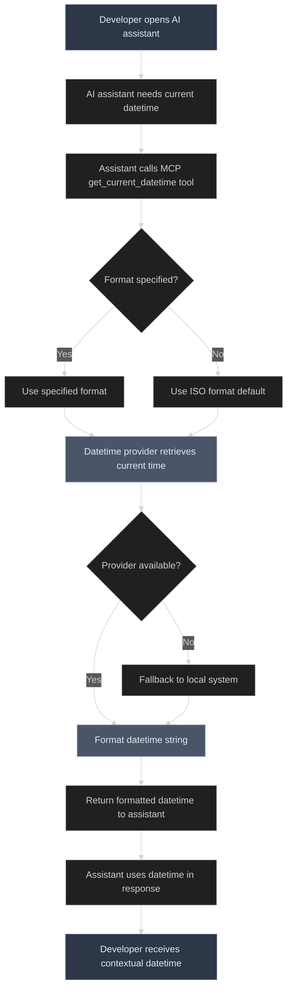

# Software Requirements Specification - @strix-ai/currentdt-mcp

> **Built for AI, Built with AI** - Systematically designed through AI collaboration to enhance AI capabilities

**Author:** Biswajit Panday  
**Email:** biswajitmailid@gmail.com  
**Website:** biswajitpanday.github.io  
**Version:** 1.1.1  
**Date:** August 23, 2025

## 1. Introduction

### 1.1 Purpose
This document specifies the software requirements for @strix-ai/currentdt-mcp, an MCP (Model Context Protocol) server that provides current date and time functionality to AI assistants and development environments.

### 1.2 Scope
The system provides a standardized way for AI assistants to access current datetime information through the MCP protocol, supporting various date formats and providers.

### 1.3 Definitions and Acronyms
- **MCP**: Model Context Protocol - A standard for connecting AI assistants to external tools
- **Provider**: A source for datetime information (local system or remote service)
- **Tool**: An MCP-exposed function that AI assistants can invoke

## 2. Overall Description

### 2.1 Product Perspective
The system operates as an MCP server that integrates with AI development environments like Cursor, Claude Desktop, and VS Code to provide datetime functionality.

### 2.2 Product Functions
- Provide current date and time on demand
- Support multiple date format options
- Allow configurable datetime providers
- Maintain MCP protocol compliance
- Enable easy integration with MCP clients

### 2.3 User Classes
- **Primary Users**: Developers using AI assistants for code generation
- **Secondary Users**: AI assistants requiring datetime context
- **Tertiary Users**: System administrators configuring MCP servers

## 3. Functional Requirements

### 3.1 Core Datetime Functionality

#### FR-001: Current Datetime Retrieval
**Priority:** High  
**Description:** The system shall provide the current date and time when requested.
- **Input:** MCP tool invocation
- **Output:** Current datetime in specified format
- **Acceptance Criteria:**
  - Returns accurate current datetime
  - Supports timezone awareness
  - Handles concurrent requests efficiently

#### FR-002: Date Format Configuration
**Priority:** High  
**Description:** The system shall support configurable date formats.
- **Formats Supported:**
  - ISO 8601 (default): `2025-08-26T14:30:00.000Z`
  - Custom formats using standard format strings
- **Acceptance Criteria:**
  - Default to ISO format if no format specified
  - Validate custom format strings
  - Return formatted datetime string

#### FR-003: Provider Selection
**Priority:** Medium  
**Description:** The system shall support multiple datetime providers.
- **Providers:**
  - Local system clock (default)
  - Remote time services (future enhancement)
- **Acceptance Criteria:**
  - Configurable provider selection
  - Graceful fallback to local provider
  - Provider health checking

### 3.2 MCP Integration

#### FR-004: MCP Protocol Compliance
**Priority:** High  
**Description:** The system shall fully comply with MCP protocol specifications.
- **Requirements:**
  - Implement standard MCP server interface
  - Handle MCP message types correctly
  - Provide proper tool definitions
- **Acceptance Criteria:**
  - Compatible with standard MCP clients
  - Proper error handling and responses
  - Tool discovery and invocation support

#### FR-005: Tool Definition
**Priority:** High  
**Description:** The system shall expose datetime functionality as MCP tools.
- **Tool Name:** `get_current_datetime`
- **Parameters:**
  - `format` (optional): Date format string
  - `provider` (optional): Provider selection
- **Acceptance Criteria:**
  - Tool appears in MCP client discovery
  - Proper parameter validation
  - Clear tool description and documentation

## 4. Non-Functional Requirements

### 4.1 Performance Requirements

#### NFR-001: Response Time
- **Requirement:** Datetime requests shall complete within 100ms
- **Rationale:** Ensure responsive AI assistant interactions

#### NFR-002: Throughput
- **Requirement:** Support minimum 100 concurrent datetime requests
- **Rationale:** Handle multiple AI assistant instances

### 4.2 Reliability Requirements

#### NFR-003: Availability
- **Requirement:** System uptime of 99.9%
- **Rationale:** Critical for development workflow integration

#### NFR-004: Error Handling
- **Requirement:** Graceful degradation when providers fail
- **Rationale:** Maintain functionality under various conditions

### 4.3 Usability Requirements

#### NFR-005: Configuration Simplicity
- **Requirement:** Single configuration file for all settings
- **Rationale:** Easy setup and maintenance

#### NFR-006: Integration Ease
- **Requirement:** One-command installation for common MCP clients
- **Rationale:** Reduce setup friction for developers

### 4.4 Maintainability Requirements

#### NFR-007: Code Quality
- **Requirement:** Follow SOLID principles and maintain 90%+ test coverage
- **Rationale:** Long-term maintainability and reliability

#### NFR-008: Extensibility
- **Requirement:** Plugin architecture for custom providers
- **Rationale:** Support future enhancements without core changes

## 5. System Interfaces

### 5.1 MCP Client Interface
- **Protocol:** JSON-RPC over stdio/WebSocket
- **Message Format:** Standard MCP message structure
- **Tool Invocation:** Standard MCP tool calling pattern

### 5.2 Configuration Interface
- **Format:** JSON configuration file
- **Location:** User-defined or default system location
- **Validation:** Schema-based validation on startup

## 6. User Flow Diagram

## 7. Use Cases

### 7.1 UC-001: Generate Date-Stamped Filename
**Actor:** Developer (Alice)  
**Preconditions:** MCP server running, AI assistant connected  
**Flow:**
1. Alice asks AI to create SQL script with date-stamped filename
2. AI assistant invokes `get_current_datetime` tool
3. System returns current datetime in ISO format
4. AI assistant generates filename: `migration_2025-08-26T14-30-00.sql`
5. Alice receives properly dated filename without manual input

### 7.2 UC-002: Custom Date Format Request
**Actor:** Developer  
**Preconditions:** MCP server configured  
**Flow:**
1. Developer needs specific date format for logging
2. AI assistant calls tool with custom format parameter
3. System validates and applies custom format
4. Returns formatted datetime string
5. AI assistant uses in generated code

## 8. Constraints and Assumptions

### 8.1 Technical Constraints
- Must operate within MCP protocol specifications
- Node.js runtime environment required
- Limited to datetime providers with programmatic access

### 8.2 Business Constraints
- Open source distribution under permissive license
- Maintain compatibility with major MCP clients
- Minimize external dependencies

### 8.3 Assumptions
- Users have basic familiarity with MCP configuration
- AI assistants properly implement MCP client protocol
- System clock accuracy is acceptable for most use cases

## 9. Acceptance Criteria

### 9.1 System Acceptance
- [ ] All functional requirements implemented and tested
- [ ] Performance benchmarks met
- [ ] Compatible with Cursor, Claude Desktop, and VS Code
- [ ] Documentation complete and accurate
- [ ] Package published to npm registry

### 9.2 User Acceptance
- [ ] Alice's user story successfully demonstrated
- [ ] Zero-configuration setup for common scenarios
- [ ] Error messages are clear and actionable
- [ ] Integration examples work as documented